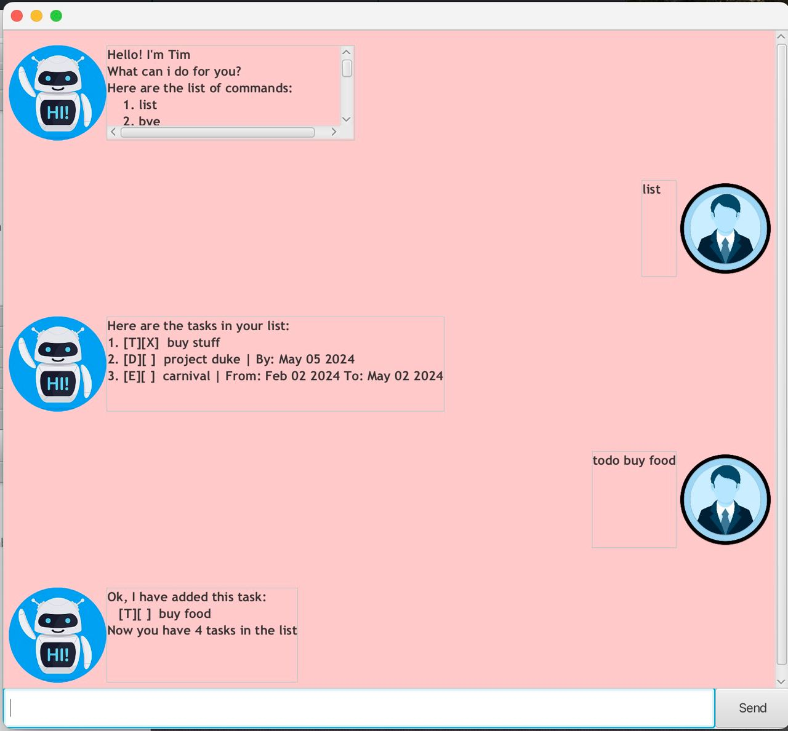

# Tim User Guide



Tim is application that can be used to keep track of tasks, optimized for use via a Command Line Interface (CLI) 
while still having the benefits of a Graphical User Interface (GUI).

## Features
- Add Todo task `todo`
- Add Deadline task `deadline`
- Add Event task `event`
- Listing all tasks `list`
- Find task by keyword `find`
- Find task in time period `check dates`
- Mark task as done `mark`
- Unmark task as not done `unmark`
- See list of commands `help`
- Delete a task `delete`
- Quit the program `bye`
- Notes can be added when adding tasks
- Commands are **case-sensitive**


## Add Todo task
Adding a task to be done

_Example:_ `todo buy stuff`

```
Ok, I have added this task:
   [T][ ]  buy stuff
Now you have 3 tasks in the list
```

## Add Deadline task
Adding a task to be done by a deadline

_Example:_ `deadline project duke /by 5/5/2024`

```
Ok, I have added this task:
   [D][ ]  project duke | By: May 05 2024
Now you have 4 tasks in the list
```

## Add Event task
Adding an event that occurs over a period of time

_Example:_ `event carnival /from 2/2/2024 /to 2/5/2024`

```
Ok, I have added this task:
   [E][ ]  carnival | From: Feb 02 2024 To: May 02 2024
Now you have 5 tasks in the list
```

## List all tasks
Listing all the tasks in the list

_Example:_ `list`

```
Here are the tasks in your list:
1. [T][ ]  buy stuff
2. [D][ ]  project duke | By: May 05 2024
3. [E][ ]  carnival | From: Feb 02 2024 To: May 02 2024
```

## Find tasks
Finding tasks in the list by keyword

_Example:_ `find project`

```
Here are the matching tasks in your list:
1. [D][ ]  project duke | By: May 05 2024
```

## Mark or Unmark tasks
Marking tasks as done or undone

_Example:_ `mark 1`

```
OK, I've marked this task as done:
   [T][X]  buy stuff
```

## See list of commands
See all the commands that can be used

_Example:_ `help`

```
Here are the list of commands:
    1. list
    2. bye
    3. deadline {task} /by {date}
    4. todo {task}
    5. event {task} /from {date} /to {date}
    6. check dates {date} {date}
    7. find
    8. help
    9. mark {task_num}
   10. unmark {task_num}
   11. delete 
```

## Delete tasks 
Deleting task from the list

_Example:_ `delete 5`

```
OK, I've removed this task:
   [T][ ]  go school
Now you have 4 tasks in the list.
```

## Check Schedule
Find tasks that occur within the specified date range

_Example:_ `check dates 1/1/2024 12/12/2024`

```
This are the tasks within the period you stated:
1. [D][ ]  project duke | By: May 05 2024
2. [E][ ]  carnival | From: Feb 02 2024 To: May 02 2024
```

## Exit application
Leave the application

_Example:_ `bye`

```
Bye. Hope to see you again soon!
```

## Command Summary
- `list`: List all tasks
- `bye`: Leave application
- `deadline {task} /by {date}`: Store deadline task
- `todo {task}`: Store Todo task
- `event {task} /from {date} /to {date}`: Store Event task
- `check dates {date} {date}`: Check tasks within stated period
- `find {keyword}`: Find tasks by keyword
- `help`: See list of commands
- `mark {task_num}`: Mark tasks as done
- `unmark {task_num}`: Mark tasks as not done
- `delete {task_num}`: Delete task from list

